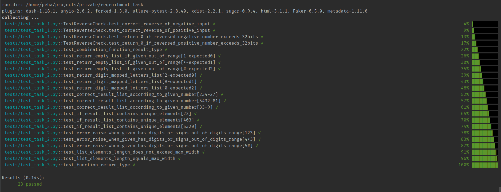

## 3 recruitment tasks

---

Contains code of 3 tasks together with tests (unittests and pytest code) and documentation.




---


### Table of Contents

- [Technologies](#Technologies)
- [How To Run HTML Documantation](#Documentation)
- [How To Run Tests](#How-To-Run-Tests)
- [Autho Info](#author-info)

---


### Technologies

- pytest 6.2.4
- Sphinx 4.1.2

[Back to the Top ^](#Table-of-Contents)

---

### How To Run HTML Documantation

Documentation is based on code docstrings and was generated with Sphinx tool.

Documentation index.html file open file in default browser window.

File to run documentation is placed within path:
```
Docs/_build/html/index.html
```

[Back to the Top ^](#Table-of-Contents)

---

### How To Run Tests
To run all tests, type:

```
pytest -v tests
```

or choosing specific file, add file path;

```
pytest -v tests/test_file_name.py
```

[Back to the Top ^](#Table-of-Contents)

---

### Author Info

- Przemyslaw Hinca -> Github: [pshemekhinca](https://github.com/pshemekhinca)

[Back to the Top ^](#Table-of-Contents)
